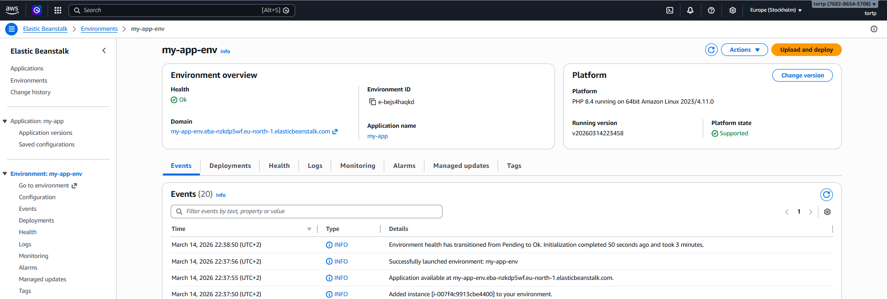
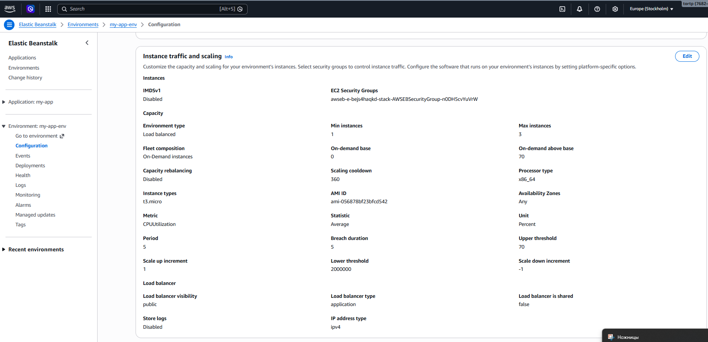
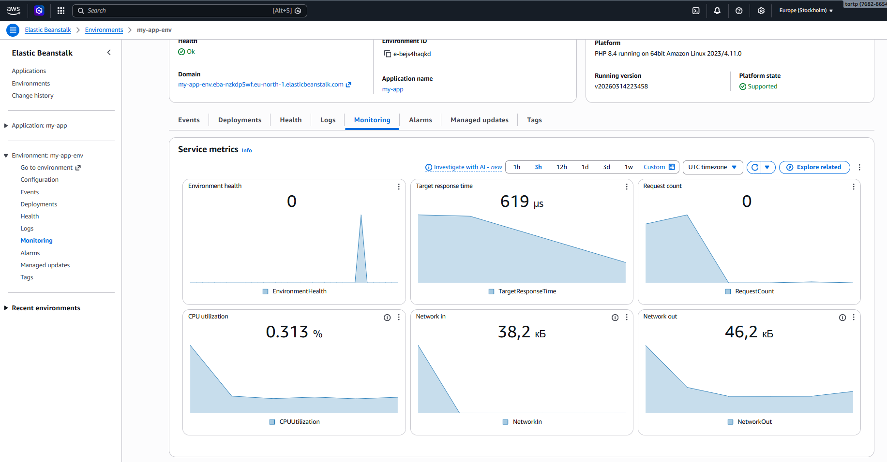
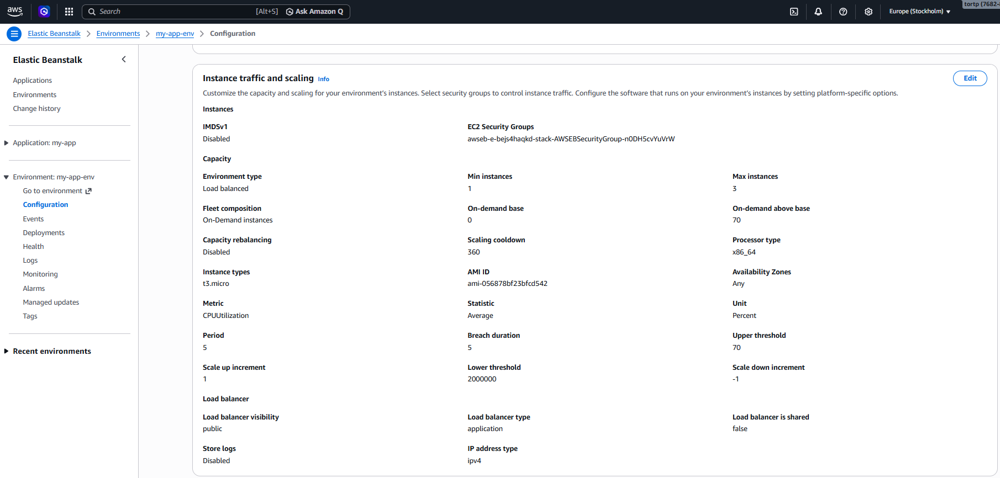
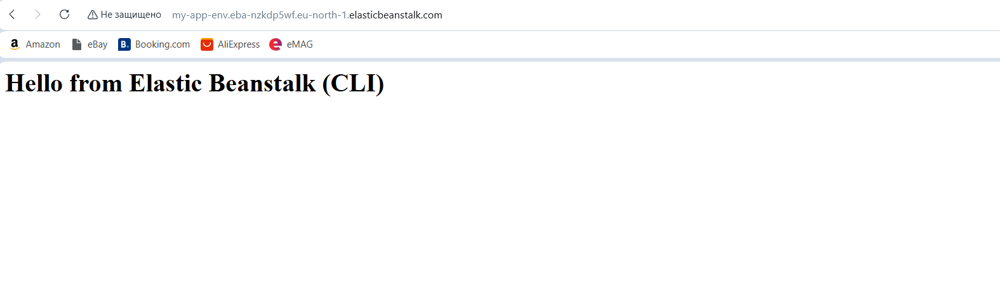

# ДЗ9 - AWS Elastic Beanstalk

---

## 1) Створення застосунку в Elastic Beanstalk

---

## 2) Налаштування середовища

---

## 3) Моніторинг і логування

---

## 4) Налаштування масштабування

---

## 5) Перевірка доступу до застосунку

-
